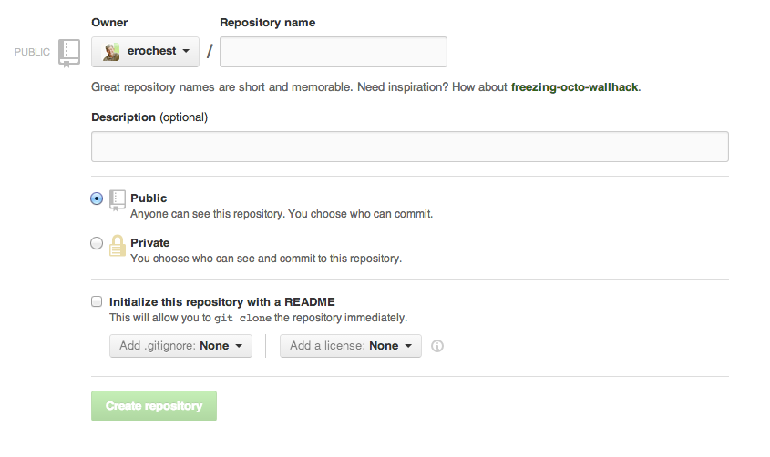
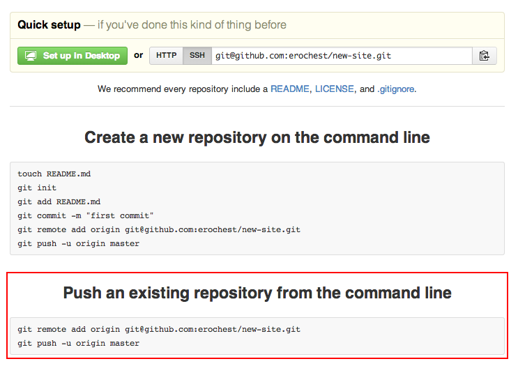
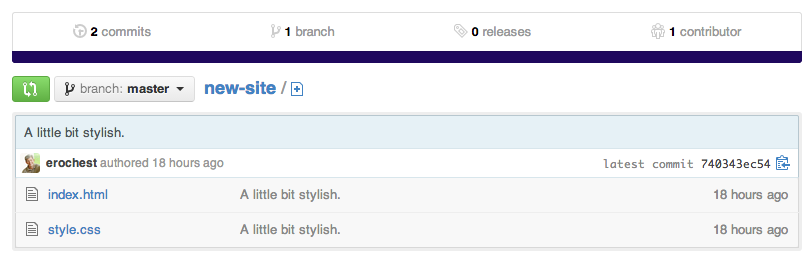
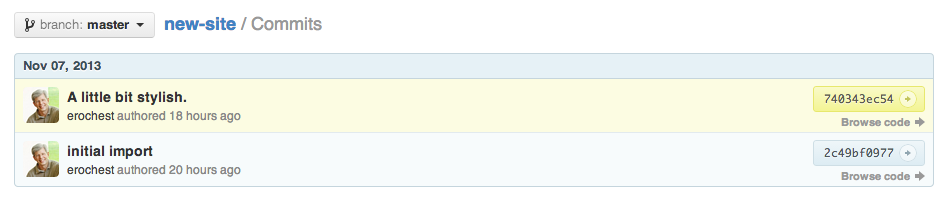
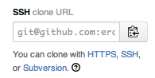

% Git Workshop
% Eric Rochester
  Scholars' Lab
% November 8, 2013

## 

What is It?

Why Use it?

Git's Worldview

Creating a Project

Changing a Project

Sharing a Project

# What is It?

## Distributed

<div class="notes">
Easy to share.
</div>

## Version

<div class="notes">
Track changes.

What changed?

When?

Why?
</div>

## Control

<div class="notes">
Can I get rid of a change?

Can I try something without messing up what I have?
</div>

## System

<div class="notes">
Adds process.

Good and bad.

You can use this to your advantage, or it can get in your way.
</div>

# Why Use It?

## File Backup

```

$ ls
Paper.doc
Paper-aug-30-300.doc
Paper-aug-4-700.doc
Paper-aug-4-800.doc
Paper-jul-31-730.doc
Paper-sept-1-830.doc
$ cp Paper.doc Paper-nov-8-400.doc

```

## Directory Backup

```

$ ls
website/
website-aug-30-300.zip
website-aug-4-700.zip
website-aug-4-800.zip
$ zip -r website website-nov-8-400.doc

```

## What's Wrong with this Picture?

> * When did I remove that section?
> * What was I working on Aug 4?
> * Was that 8:00 AM or PM?
> * When did I change the stylesheet?
> * How do I collaborate?
> * If I send someone a ZIP, how do I get the changes back out? What if we've
>   both changed something?

## How Does Git Fix it?

> * Commits and commit messages
> * History
> * Branches

## Git Doesn't Do

> * Website hosting
> * Build system
> * Archiving or backup

# How Does Git See the World?

<div class="notes">
Concentric worldview.

Like layers of an onion.
</div>

## Working Directory

<div class="notes">
This you know. This is what you currently have.
</div>

## Staging

<div class="notes">
Things in here aren't in version control, but they almost are.
</div>

## The Repository

<div class="notes">
Here is where git tracks your files, changes, and history.
</div>

## Remotes

<div class="notes">
When you're ready to share your project and get other people working on it too.

We may not get to this today.
</div>

# Creating a Project

## 

```

$ mkdir new-site
$ cd new-site
$ git init
Initialized empty Git repository in /Users/err8n/tmp/new-site/.git/

```

<div class="notes">
We've just created a directory for a project.

We've told git that we want to track the changes to some of the files in this
directory.

Git has created a .git directory. That will contain everything that git knows.
We don't have to worry about what's in there or look in it.

Right now there aren't any files in here, though. Let's fix that.
</div>

## 

```

$ touch index.html
$ ## edit index.html
$ git status
# On branch master
#
# Initial commit
#
# Untracked files:
#   (use "git add <file>..." to include in what will be committed)
#
#       index.html
nothing added to commit but untracked files present (use "git add" to track)

```

<div class="notes">
git status tells us what git thinks about the world right now.

Right now, git knows that there's a file in the directory, but it's not paying
attention to it.

This also gives us a hint of what we can do next.
</div>

## 

```

$ git add index.html
$ git status
# On branch master
#
# Initial commit
#
# Changes to be committed:
#   (use "git rm --cached <file>..." to unstage)
#
#       new file:   index.html
#

```

<div class="notes">
With the git add command, git is now paying attention to index.html. It's not
tracking any changes, but we've told git that we want to remember that file
*the way it is right now*. If we make any more changes, they won't be included.

At this point, the index.html file has moved from the working directory into
staging. It's not being tracked, but it's ready to be.

From the status, we can see that one file---one that git has just learned
about---is ready to be committed. That is, it's in staging.
</div>

##

```

$ git commit -m "initial import"
[master (root-commit) 2c49bf0] initial import
 1 file changed, 15 insertions(+)
  create mode 100644 index.html
$ git status
# On branch master
nothing to commit, working directory clean

```

<div class="notes">
This used the git commit command.

Now the file, as it is, is being tracked in the repository. The changes have
moved out of staging and are in the permanent (more or less) record.

We also included a message here, with the "-m" switch and the string after it.
That will help us identify the commit later and remember what we did with it.

If you don't specify the commit message on the command line, git will open up
an editor so you can enter the command into it. By default, it will probably
use vi or something similarly unfriendly. Use the command line and the "-m"
switch until you can change your default editor (which we won't do now).
</div>

## 

```

$ git log
commit 2c49bf0977c74ce232cb52fcb8d129e32ee94f28
Author: Eric Rochester <erochest@virginia.edu>
Date:   Thu Nov 7 15:24:46 2013 -0500

    initial import

```

<div class="notes">
git log is the command we use to look at what's happened in the repository.
Take the output apart.
</div>

# Changing a Project

## 

```

$ # edit index.html again.
$ touch style.css
$ # edit style.css
$ git status
# On branch master
# Changes not staged for commit:
#   (use "git add <file>..." to update what will be committed)
#   (use "git checkout -- <file>..." to discard changes in working directory)
#
#       modified:   index.html
#
# Untracked files:
#   (use "git add <file>..." to include in what will be committed)
#
#       style.css
no changes added to commit (use "git add" and/or "git commit -a")

```

<div class="notes">
What do you see here?

index.html has been modified.

style.css is new.
</div>

## 

```

$ git diff
diff --git a/index.html b/index.html
index 8a5f865..6f7d64e 100644
--- a/index.html
+++ b/index.html
@@ -3,6 +3,7 @@
 <head>
     <title></title>
     <meta charset="utf-8" />
+    <link rel="stylesheet" href="style.css" type="text/css">
 </head>
 <body>
     <header>

```

<div class="notes">
git diff shows us the current set of changes in the working directory for files
that are being tracked.
</div>

## 

```

$ git add index.html style.css
$ git status
 # On branch master
 # Changes to be committed:
 #   (use "git reset HEAD <file>..." to unstage)
 #
 #       modified:   index.html
 #       new file:   style.css
 #

```

<div class="notes">
Now we've put a modified index.html and a new style.css into the staging area.
</div>

##

```

$ git commit -m "A little bit stylish."
[master 740343e] A little bit stylish.
 2 files changed, 4 insertions(+)
  create mode 100644 style.css

```

##

```

$ git status
# On branch master
nothing to commit, working directory clean

```

##

```

$ git log
commit 740343ec54003a3c70ea2faef961ee22b4c0e2ff
Author: Eric Rochester <erochest@virginia.edu>
Date:   Thu Nov 7 16:57:05 2013 -0500

     A little bit stylish.

commit 2c49bf0977c74ce232cb52fcb8d129e32ee94f28
Author: Eric Rochester <erochest@virginia.edu>
Date:   Thu Nov 7 15:24:46 2013 -0500

      initial import

```

# Sharing a Project

## Walking Uphill Both Ways

* Running your own server.
* Emailing diffs.

## Github

The unholy spawn of Facebook and git.

Let's get an account!

https://github.com

## Plays Well With Others

> * Organizations
> * Collaborators
> * Forking
> * Pull Requests

## Remote Repositories

Let's create a new repository on Github.


##



##



## Let's Do That Then!

```

$ git remote add origin git@github.com:erochest/new-site.git
$ git push -u origin master

```

## Refresh



##



## Github

### The Clone Wars



# MOAR!

## Branches

## Workflows

## Forking

# More Resources

## Git

[http://git-scm.com/](http://git-scm.com/)

## Github

[https://github.com/](https://github.com/)

## A Great Cheatsheet

[http://rogerdudler.github.io/git-guide/files/git_cheat_sheet.pdf](http://rogerdudler.github.io/git-guide/files/git_cheat_sheet.pdf)

## Scholars' Lab Resources

* [http://praxis.scholarslab.org/tutorials/git/](http://praxis.scholarslab.org/tutorials/git/)
* [http://praxis.scholarslab.org/topics/intro-to-git/](http://praxis.scholarslab.org/topics/intro-to-git/)

